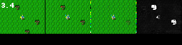

# Critic Vae Masks For Crafter 
Fork of https://github.com/lcicek/Critic-VAE. I adapted the model made by ***lcicek*** and applied it to crafter.

Leverages the critic-model: [Critic](https://github.com/ndrwmlnk/critic-guided-segmentation-of-rewarding-objects-in-first-person-views)

Train a critic CNN and a VAE on crafter images. 

More detailed info can be found in my [project report](docs/Critic_guided_VAE_for_Crafter.pdf).

The graphics used in the report can be recreated using [notebooks/plots_and_picutres.ipynb](notebooks/plots_and_picutres.ipynb)

# What does it do?

The critic learns to predict if the reward (trees) are present or not in a frame. After training the critic the VAE is trained to reconstruct the frames while being supplied the trained critics prediction in latent space. After succesful training the VAE can hallucinate trees into an empty picture given a high critic value and remove them given a low one. One possible application is to use the difference between high and low value reconstructions to mask the reward. 


<p align="left">
  
</p>

<sup>From left to right: original frame, reconstruction with original critic value, reconstruction with low critic value, difference mask</sup>

# Installation and Usage

If you just want to train the models with different parameters you can use the google colab implemetations:

[Critic training on colab](https://colab.research.google.com/drive/14-KIMmQElpW2zbtTQOU2RlhOzl-rUfzM?usp=sharing) \
[VAE training on colab](https://colab.research.google.com/drive/1YoAEnPFhnybgOPynUT_ljcY_Hoh-ilkb?usp=sharing)

## Installation for Local training
You will need **python>=3.9.12** to run this. Just install the dependencies with 

```
python -m pip install -r requirements.txt
```

## Train Critic

After you installed it you can start the critic training with 

```
python crafter_extension_train_critic.py
```

You will find the model in the `crafter_models` folder and a training log named `crafter_critic_training_log.csv` in the root folder.

## Train VAE

To train the VAE use

```
python vae.py -train-crafter -crafter-windowsize 20 -crafter-dataset-size 50000 -crafter-epochs 400
```

The final trained model will be in `saved-networks`, while training checkpoints can be found in `crafter_models/crafter_vae_checkpoint`. 

In `crafter_images` reconstruction images of train and test set will be availeble after training. In `crafter_images/images_per_epoch` you will find reconstructions of the same image made after each epoch. In `images` the original difference mask done by ***lcicek*** can be found.
