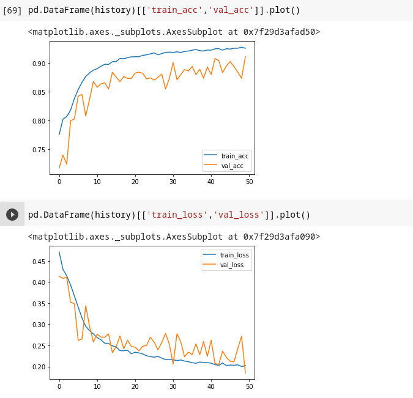
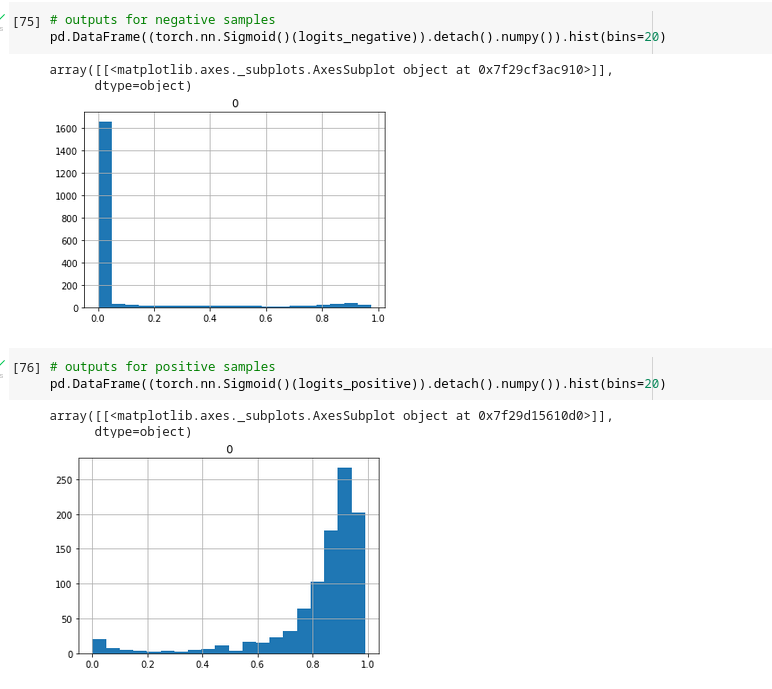
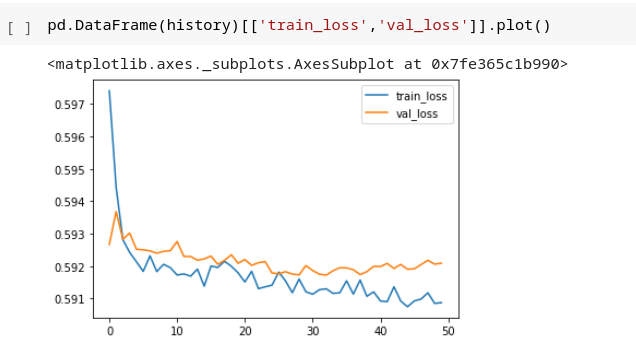
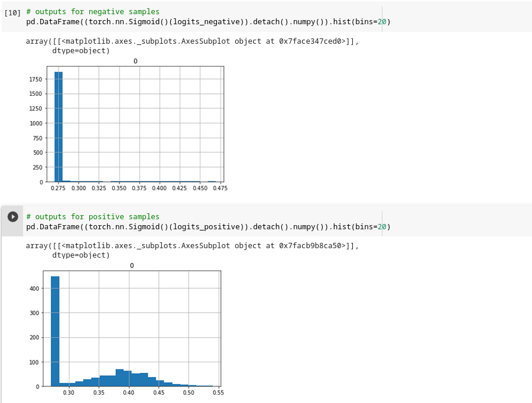
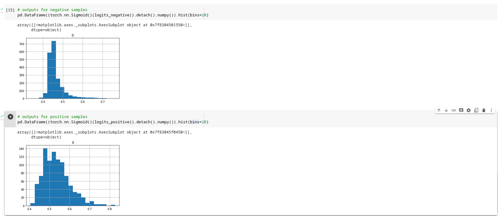
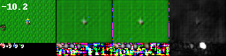

# Critic VAE on crafter

## Critic training

### Reward
The reward is chosen as getting a wood log.

I tried 2 approaches:
### 1. Categorical Critic

The critic is trained with Binary crossentropy loss (categorical loss)

#### Dataset

Uses raw dataset, heavily oversampling positive(reward) samples to make 0/1 class balance equal.
#### Results 
Results seem good:

Loss curves:

Result distribution(first for negative samples, second for positive):

The result distribution is very binary though, so I also tried a second approach:

### 2. Real Critic

The critic is trained with MSE loss (real loss)

#### Dataset

The reward is linearly interpolated backwards from the reward moment for 50 steps, i.e. at step 50 the reward is 1, at 0 it is 1/50, at 25 it is 25/50 ...
I tried both, the raw and a balanced dataset. The balanced one is constructed to have equal amount of low(0-0.25), med (0.25-.75) and high(0.75-1) reward samples. 

#### Results

On the raw dataset is seemed good at first:

But the result distribution shows, it only learns to predict around the mean ...

On the balanced dataset, the model somehow fails to learn:

Yet the result distribution is similar, just with the new mean of the dataset.

## VAE training

The categorical critic is used because it worked better.

### Dataset

The crafter pictures are used as a drop-in replacement for the already existing code. The over/undersampling by critic value is reproduced.

### first training results

The model learns good, but this is a typical result picture:

I suspect the model to just learn the inventory position of the logs ... a trivial result but promosing nonetheless.

### Training VAE without inventory

With the same critic model and the same dataset, the VAE is trained again, setting all inventory pixels to (0,0,0), only for the vae. 

The [results](https://drive.google.com/drive/folders/1k2nV2d1dHhlAZUzOWg2r4mOPuYnjA8b0?usp=sharing) **don't seem to be useful.**

### There are multiple things to try:

* investigate VAE loss curves and training data
    * does VAE learn without inventory?!
* investigate critic performance further
    * for which pictures is a high/low reward value given
    * does it make sense?
* train the critic without inventory
    * it could be, that the VAE can only find the inventory relation because the critic learned it ...
* use sparse reward (only first log)
    * in crafter multiple rewards (trees) are visible often times, this could be a problem when using each obtained log as a reward
    * sparse reward could make more sense
* fix real critic
    * maybe the original count of 'med' pictures is too low, or the oversampling approach is wrong 
* change dataset for VAE
    * maybe a different distribution of low,med,high pitures is needed

